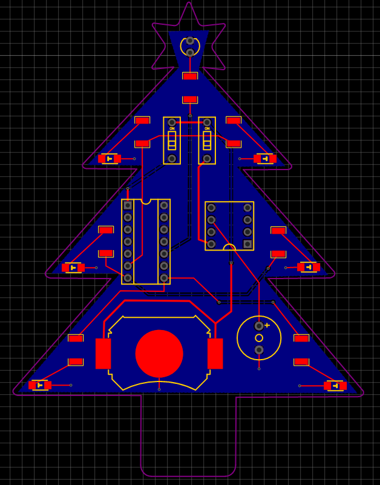
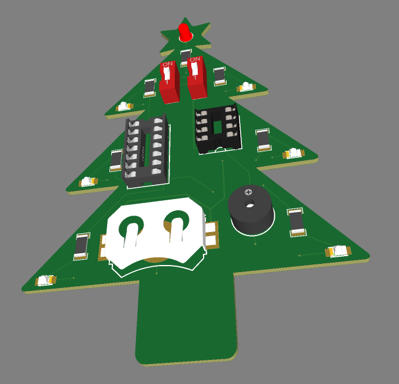

# Glowing and singing christmas tree

## About
My goal for this project was to design a simple PCB that has sparkling LEDs as well as a little buzzer that is able to play a nice Christmas song. Because of conflicting timing issues two chips were used: an ATTiny 85 for the buzzer and an ATTiny 84 to control the lights. The code for the buzzer is taken from [here](https://github.com/robsoncouto/arduino-songs). The LEDs should sparkle, e.g. blink with continuous noise. Therefore they are connected to PWM pins where the value is governed by the Perlin noise function from the FastLED library. 

## Video

https://user-images.githubusercontent.com/18304360/145694686-5ff423a5-cd0f-4f8a-95ec-dfabd4011db3.mp4

## Circuit diagram

## PCB 

 

## Important Notes

Always do "Burn Bootloader" in Arduino IDE, otherwise the code does'nt work properly!
